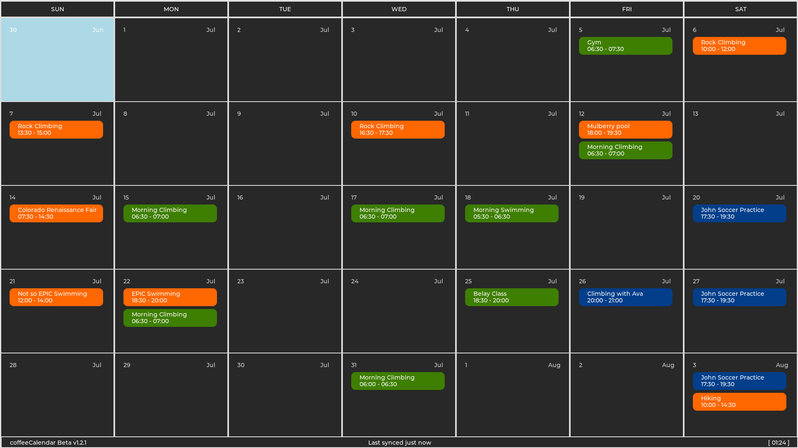
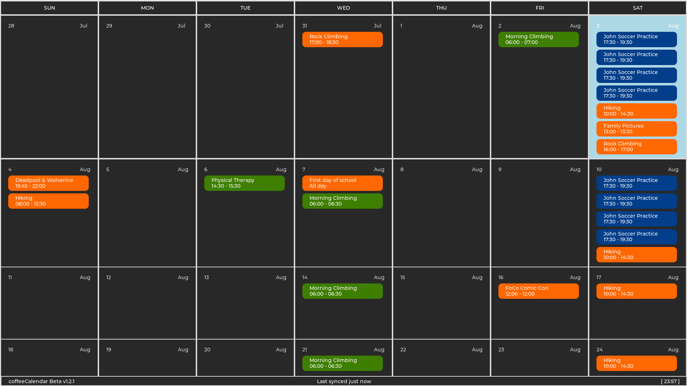

# coffeeCalendar
coffeeCalendar is a linux framebuffer digital calendar made to replace a traditional wall calendar in a office space/family room.

---
### Features
- Automatic download & display of events from any ical download link
- Dynamic tile sizes to show all events for a given day
- Simple UI to see future events at a glance
- Runs continuously with no user input 
- Ability to be drawn to a a linux framebuffer quickly with no gpu acceleration

---

### Building

#### Deps:
- cmake
- libical
- libcurl

Then run these commands to download and compile coffeeCalendar

```bash
git clone https://github.com/KaffeinatedKat/coffeeCalendar.git
cd coffeeCalendar
mkdir build && cd build
cmake ..
make
```

---

### Setting up online calendars

You can easily set up online calendars in the coffeeCalendar configuration file

coffeeCalendar looks for the config file at `~/.config/coffeeCalendar/config`


#### Config file:

First, copy the default config file there with

```bash
cp coffeeCalendar/config.example ~/.config/coffeeCalendar/config
```

#### Getting your calendar links

coffeeCalendar downloads calendars from iCalendar links, which most online email providers give you access to. 

_coffeeCalendar does not support any kind of authorization when downloading, and requires a public link. These links are insecure and should never be shared with anyone_

- [How to obtain secret link for google calendar](https://support.google.com/calendar/answer/37648?hl=en#zippy=%2Cget-your-calendar-view-only)
- [How to obtain secret link for protonmail](https://proton.me/support/share-calendar-via-link#how-to-share-a-calendar-with-anyone)

#### Adding the links

Edit the config file using your favorite text editor

The config option you're looking for is `online_calendars`, and it's a simple array of links:

```
online_calendars = ["https://notareallink.com/first_cal.ics", \
                    "http://insecurefakelink.net/second_cal.ics"]
```

Simply add all your links to this array

#### Setting up the colors

All the events are colored based on what link they came from, and setting these up is just as easy

The config option here is `online_calendar_colors` and it's an array of hex colors

```
online_calendar_colors = ["0x023E8A", "0x276221"]
```

Each hex color is the color that is used for the events from the link in the same order as `online_calendars`

___online_calendar_colors and online_calendars must have the same number of elements___

#### Customizing the refresh interval

The calendars are synced automatically every 30 minutes, this can be changed with the `cal_refresh_time` option

```
// Time in minutes
cal_refresh_time = 30
```

---

### Images




